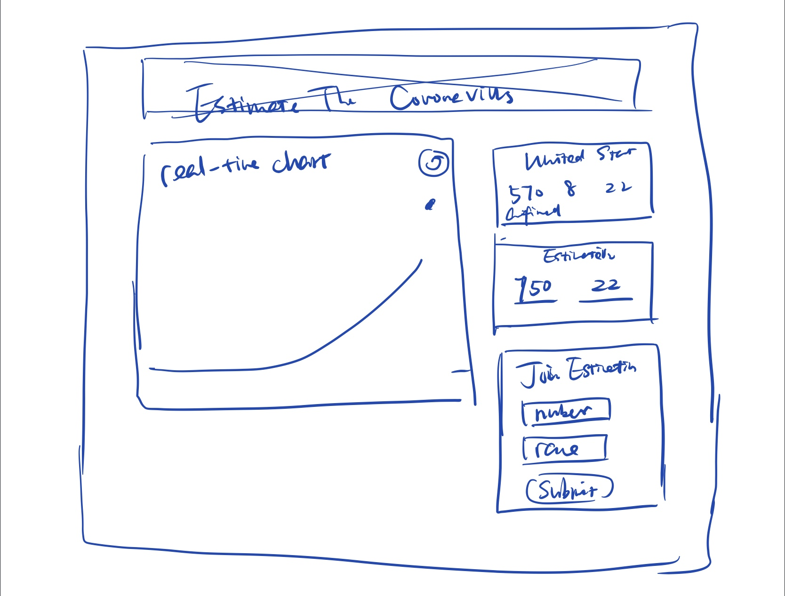

# Predicting The Coronavirus

Gather data from people about their prediction on future coronavirus cases. 
See video demo is here. The deployment fails, still debuging it. But it runs smoothly on my localserver.
[](https://youtu.be/Xd_BGfLHVj8)

# About
It's a dashboard that allows users to monitor the current coronavirus situation and predict the upcoming coronavirus case in the next day. Data source from [1point3acres](https://coronavirus.1point3acres.com/en).
<br /><br />
It contains mainly three parts: (1)the monitoring data of coronavirus history data from other websites; (2) user's input estimation data i total; (3) averaged estimated data by date.


# Prerequisites & Installation
If you want to use it on your computer, you need to download node and dependencies to run the project. Follow [this guide](https://github.com/itp-dwd/2020-spring/blob/master/guides/installing-nodejs.md) to install node.js. And also install the following dependencies.<br />

Install NeDB database.
~~~ 
npm install NeDB
~~~
Install express.js
~~~ 
npm install express
~~~
Install cheerio to run JQuery-like syntax
~~~ 
npm install cheerio
~~~
Install superagent to crawl data from website.
~~~ 
npm install supergent
~~~

# Inspiration

Coronavirus is scary. The more scary thing is people's attitudes towards it. Lots of people think that Asians overact and overestimate the coronavirus. So I'd like to make something to gather different people's opinions to see if this's true.<br /><br />
So I want to use people's prediction of the incoming coronavirus cases to see their attitudes in an indirect way. Most importantly, to see the differences among races.

# Reqirements
1. Dashboard-like interface.
2. Real-time coronavirus data(line chart), averaged predicted data (scatter)
3. Readl-time and averaged predicted data and people. 
4. Form to ask the prediction.

# Design
The sketch is as below.


The next step is to design hi-fi prototype in sketch. I tried two version and finally chose the second one.


# Difficulties in Development
There're lots of difficulties that I can foresee, like crawling data. But there're way much more problems that I can only realize when I actually do it. I'd like to record every of my obstacle here.

<strong>About Data Crawling</strong><br />
In node.js, I used ```supergeny + cheerio``` to crawl data from the website. But the [website](https://coronavirus.1point3acres.com/en) used [Echarts](https://www.echartsjs.com/en/index.html) to load the data dynamically and the default language of the page is Chinese, which made the original crawling data hard to clean. 
<br />What made things hard was that the website is super unstructured and the ``` class ``` for different sets of data was messy. Originally I planned to crawl the coronavirus cases in NY but had to give up due to the messy structure. 
<br />And the website updates the charts a lot. If the code doesn't work, try to compare the data I crawled with the inspected element in the web to see if the element ``` class ``` changes.
~~~
function crawlStats(){ 
  superagent.get('https://coronavirus.1point3acres.com/en').end((err, res) => { //  use superagent npm to crawl website
  if (err) {
  } else { 
    stat = getStats(res); 
  }});
}

let getStats = (res) => {  
  let $ = cheerio.load(res.text); // load website and analyze in Jquery syntax
  $('strong.jsx-889234990').each((idx, ele) => { //  the element I crawl, choose strong && .jsx-889234990 
      if(idx < 3) today_stats.push(parseInt($(ele).text())); // the first three data: confirmed, recovered, death.
    });
    console.log(today_stats)
    return today_stats;
};
~~~
<strong>About Database Setup</strong><br />

Setting up and using atabase is the hardest part during the whole process. It went smoothly when I used local JSON file to store my data, to insert, update, delete. But when it came to NeDB whose syntax is different, I encountered lots of obstacles that<strong> I still cannot solve</strong>.<br />
- I cannot update the data.  <br />
I used the following code block to update the current coronavirus case in 'coronavirus history" db (named ```db```). The logic was:
~~~
1. Check the current coronavirus data (other website) and crawl back to my own and the data looked like this 
newData {number: 789, time:2020-3-9}
2. Find the time of newData in coronavirus.db (which is db) and replace;
  if cannot find, insert one.
~~~
The code I wrote:
~~~
function updateData(newData) {
    db.update({time: newData.time}, {number:newData.number, time:newData.time});
}
~~~
I soon found that the ```update```syntax would replace the doc entirely and create new one (which is strange). I still has the problem which led to the problem of not showing the prediction data because of multiple scatters in the same spot. Every time I refreshed the page, it will insert a data into the database.


# Deployment

Login Glitch.com, create a new project by cloning from Git Repo, and paste the URL to finish.<br />
But this time, Glitch shows lots of mistakes which I never see... sigh<br />


# Reference & Credits
* [COVID-19 Real-time updates](https://coronavirus.1point3acres.com/en)
* [Echarts](https://www.echartsjs.com/en/index.html)
* [normalize.css](https://necolas.github.io/normalize.css/)


## Built with

* [VS Code](https://code.visualstudio.com/)
* [Github](https://github.com)
* [Glitch](https://glitch.com/)

## Author

* [Rebecca Zhou](https://rebeccazhou.net) 
